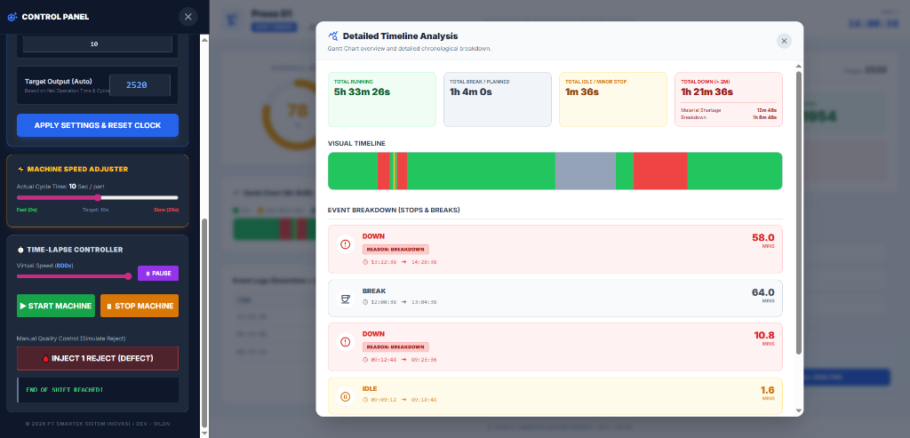
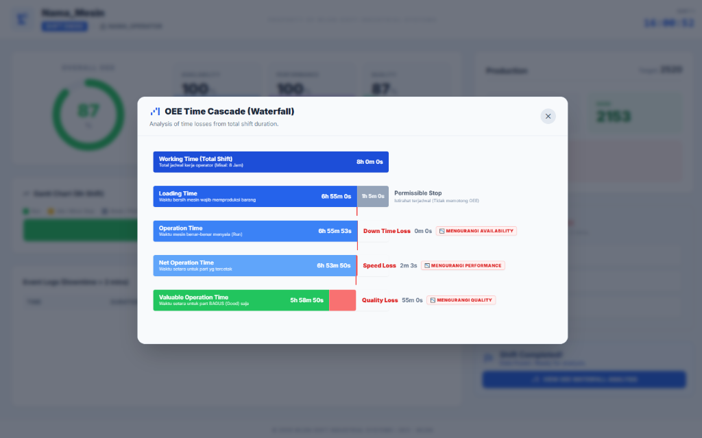
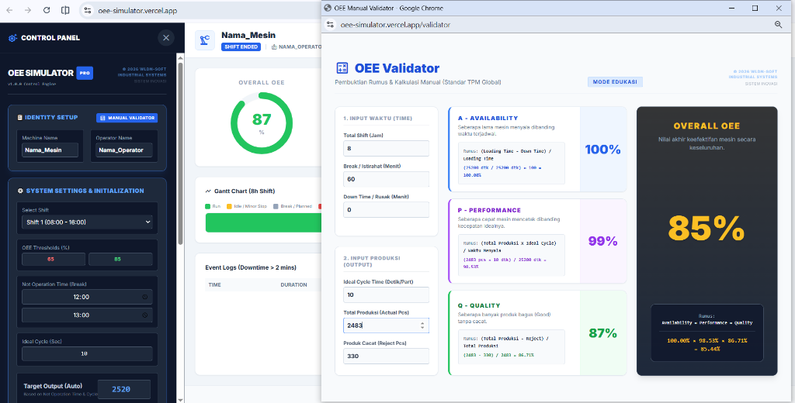

# OEE Simulator PRO + Calc


A professional Overall Equipment Effectiveness (OEE) Simulator and Dashboard built with Electron and Web Technologies.

## Features
- **Real-time OEE Engine**: Availability, Performance, and Quality tracking.
- **Time-Lapse Mode**: Simulate an 8-hour shift in minutes.
- **Interactive Dashboard**: Modern UI with sparklines, progress charts, and Gantt chart.
- **Downtime Management**: Real-time stop classification (Breakdown, Changeover, etc.).
- **OEE Waterfall Analysis**: Visual breakdown of time losses.
- **Manual Validator**: Educational tool for TPM formula verification.

## Preview Gallery
| Detailed Timeline (Gantt) | OEE Waterfall Analysis |
|---|---|
|  |  |

| Manual Validator & Education Mode |
|---|
|  |

## How to Run (Local Desktop)
1. Install dependencies:
   ```bash
   npm install
   ```
2. Start the application:
   ```bash
   npm start
   ```

## Web Deployment (Vercel)
This project is also web-ready. Simply push to GitHub and connect to Vercel.
The `index.html` serves as the main entry point for the web version.

## Developed By
- **WLDN-SOFT INDUSTRIAL SYSTEMS**
- Developer: **WLDN** (2026)
